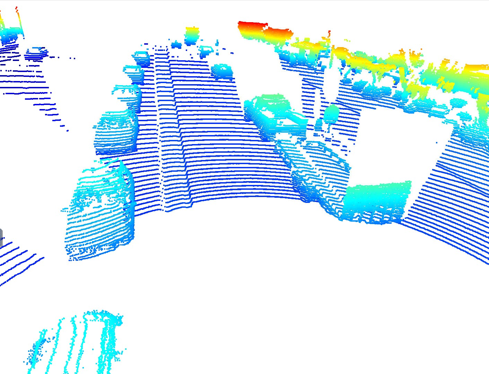
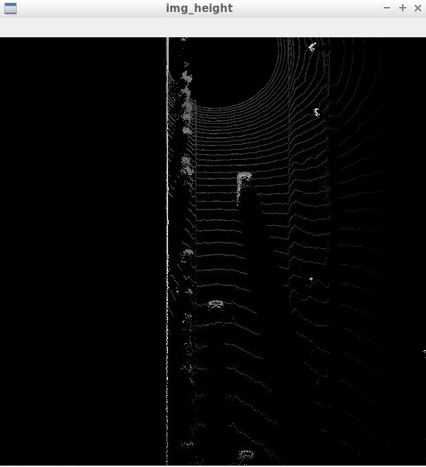

# Mid-term Project writeup

## Intro

Sections below summarize results & outputs from various steps in this project.
The [commits messages](https://github.com/brijs/udacity-self-driving-project-2/commits/main) contain the corresponding exercise IDs for easy identification.

## Step 1 : Compute Lidar Point-CLoud from Range Image
### [S1_EX1] : Visualize range image channels

<figcaption>Figure 1: Stacked range & intensity channels</figcaption>

### [S1_EX2] : Visualize Point Cloud

    
    <figcaption align="center">Animation 1: Point Cloud Open3d Visualization</figcaption>

#### Examples with varying degree of visibility

Below are some example images along with a brief text description.
|                                                          |                                                               |
|:--------------------------------------------------------:|:-------------------------------------------------------------:|
|     |           |
|          <figcaption>Car too close</figcaption>          | <figcaption>Rear view: Car hidden behind another</figcaption> |
|                                                          |                                                               |
|     |           |
|  <figcaption>Left: Tyres & Window features</figcaption>  |         <figcaption>Obstructed by trees</figcaption>          |
|                                                          |                                                               |
|    |           |
|    <figcaption>Car's bottom out of view</figcaption>     |           <figcaption>Car with trailer</figcaption>           |
|                                                          |                                                               |
|     |           |
|     <figcaption>Tyres, windows, bumpers</figcaption>     |             <figcaption>Car Mirrors</figcaption>              |
|                                                          |                                                               |
|     |           |
| <figcaption>Construction truck & Road Signs</figcaption> |        <figcaption>Car behind pedestrians</figcaption>        |
|                                                          |                                                               |
|    |                                                               |
|     <figcaption>Cars behind other cars</figcaption>      |                   <figcaption></figcaption>                   |

#### Stable Vehicle Features
- Tyres
- Window shapes
- Windshield
- Side Mirrors
- Bumpers
- Vertical sides of the cars

In general, surfaces with **better relfectivity** register better on radar. Transparent (windows & windshields etc) have low reflectivity and therefore the range intensity is low. However, this transparency seems to help as the shape of the windshield or windows are easily identifiable. 

## Step 2 : Create Birds-Eye View from Lidar PCL

### [S2_EX1] : Convert sensor coordinates to BEV-map coordinates 
|                                                     |
|:---------------------------------------------------:|
|  |
|        <figcaption>BEV from PCL</figcaption>        |

### [S2_EX2] & [S2_EX3] : Compute Intensity & Height layers of BEV-map
|                                                                   |                                                               |
| :---------------------------------------------------------------: | :-----------------------------------------------------------: |
|  |  |
|            <figcaption>BEV Img Intensity</figcaption>             |            <figcaption>BEV Img Height</figcaption>            |

## Step 3 : Model-based Object Detection in BEV Image

### [S3_EX1] & [S3_EX2] : Add FPN Resnet model, and extract 3D bounding boxes from model response
|                                                                  |
|:----------------------------------------------------------------:|
|       |
| <figcaption>FPN Resnet model output: bounding boxes</figcaption> |

## Step 4 : Performance Evaluation for Object Detection

<figcaption>Precision Recall performance</figcaption>